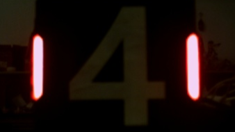
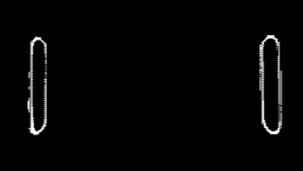
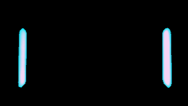
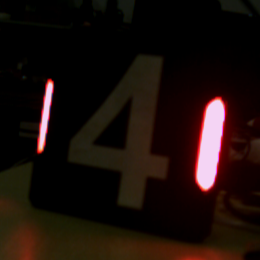
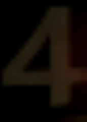
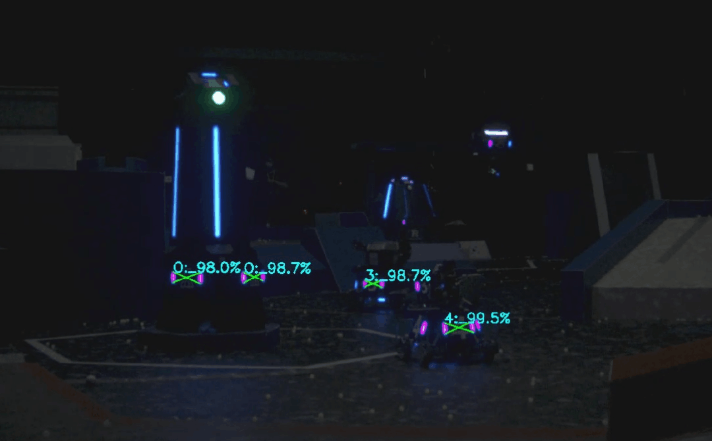

# armor_detector

订阅相机参数及图像流进行装甲板的识别并解算三维位置，输出识别到的装甲板在输入图像帧下的三维坐标（相机坐标系或通过坐标变换得到的世界坐标系）。

## detector_node.cpp

装甲板识别与位姿解算节点

### 订阅话题

*  `camera_info` (`sensor_msgs/msg/CameraInfo`) - 相机内参信息，用于初始化PnP和BA解算器
*  `image_raw` (`sensor_msgs/msg/Image`) - 图像信息，用于装甲板检测与识别

### 发布话题 

*  `detector/armors` (`auto_aim_interfaces/msg/Armors`) - 输出所有有效装甲板的识别结果与三维位姿
*  `detector/debug_lights` (`auto_aim_interfaces/msg/DebugLights`) - 调试模式下输出识别到的灯条信息
*  `detector/debug_armors` (`auto_aim_interfaces/msg/DebugArmors`) - 调试模式下输出识别到的装甲板信息
*  `detector/marker` (`visualization_msgs/msg/MarkerArray`) - 可视化装甲板的位姿与分类信息
*  `detector/binary_img` (`sensor_msgs/msg/Image`) - 二值化图像调试信息
*  `detector/number_img` (`sensor_msgs/msg/Image`) - 数字识别图像调试信息
*  `detector/result_img` (`sensor_msgs/msg/Image`) - 绘制结果图像

### 服务

*  `armor_detector/set_mode` (`auto_aim_interfaces/srv/SetMode`) - 设置视觉系统的运行模式（打符、装甲板识别等）

### 参数 

* `debug` (`bool`, default: false) - 是否开启调试模式（开启后发布调试信息）
* `binary_thres` (`int`, default: 80) - 灯条检测的二值化阈值
* `detect_color` (`int`, default: 0) - 检测颜色，0为红，1为蓝
* `classifier_threshold` (`double`, default: 0.7) - 数字分类的置信度阈值
* `ignore_classes` (`vector<string>`, default: ["negative"]) - 被忽略的分类类别

#### 灯条检测参数 (light)

* `light.min_ratio` (`double`, default: 0.1) - 灯条最小长宽比
* `light.max_ratio` (`double`, default: 0.4) - 灯条最大长宽比
* `light.max_angle` (`double`, default: 40.0) - 灯条最大倾斜角度

#### 装甲板检测参数 (armor)

* `armor.min_light_ratio` (`double`, default: 0.7) - 最小灯条高度比
* `armor.min_small_center_distance` (`double`, default: 0.8) - 小装甲板中心最小间距比
* `armor.max_small_center_distance` (`double`, default: 3.2) - 小装甲板中心最小间距比
* `armor.min_large_center_distance` (`double`, default: 3.2) - 小装甲板中心最小间距比
* `armor.max_large_center_distance` (`double`, default: 5.5) - 小装甲板中心最小间距比
* `armor.max_angle` (`double`, default: 35.0) - 装甲板对之间的最大倾斜角

## detector.cpp

装甲板识别器

### preprocessImage
对输入的RGB图像进行预处理，生成二值化后的图片

|  |  |  |
| :---------------: | :-------------------: | :--------------------: |
|       原图        |    通过颜色二值化     |     通过灰度二值化     |

由于一般工业相机的动态范围不够大，导致若要能够清晰分辨装甲板的数字，得到的相机图像中灯条中心就会过曝，灯条中心的像素点的值往往都是 R=B。根据颜色信息来进行二值化效果不佳，因此此处选择了直接通过灰度图进行二值化，将灯条的颜色判断放到后续处理中。

### findLights
从输入的RGB图像和二值化图像中寻找灯条

通过 findContours 得到轮廓，再通过 minAreaRect 获得最小外接矩形，对其进行长宽比和倾斜角度的判断，可以高效的筛除形状不满足的亮斑。

判断灯条颜色这里采用了对轮廓内的的R/B值求和，判断两和的的大小的方法，若 `mean_r > mean_b` 则认为是红色灯条，反之则认为是蓝色灯条。

|  |  |
| :---------------: | :----------------: |
| 提取出的红色灯条  |  提取出的蓝色灯条  |

### matchLights
配对灯条

根据 `detect_color` 选择对应颜色的灯条进行两两配对。首先筛除掉两条灯条中间包含另一个灯条的情况，然后根据两灯条的长度之比、两灯条中心的距离、配对出装甲板的倾斜角度来筛选掉条件不满足的结果，得到形状符合装甲板特征的灯条配对。

## number_classifier.cpp

数字分类器

### extractNumbers
提取数字

|  |  |  |  |
| :-------------------: | :--------------------: | :-------------------: | :-------------------: |
|         原图          |        透视变换        |         取ROI         |        二值化         |

将每条灯条上下的角点拉伸到装甲板的上下边缘作为待变换点，进行透视变换，再对变换后的图像取ROI。考虑到数字图案实质上就是黑色背景+白色图案，所以此处使用了大津法进行二值化。

### classify
分类

由于上一步对于数字的提取效果已经非常好，数字图案的特征非常清晰明显，装甲板的远近、旋转都不会使图案产生过多畸变，且图案像素点少，所以我们使用多层感知机（MLP）进行分类。

网络结构中定义了两个隐藏层和一个分类层，将二值化后的数字展平成 20x28=560 维的输入，送入网络进行分类。

网络结构：

<!-- 效果图： -->

<!--  -->

## light_corner_corrector.cpp

在原版rm_vision中，使用旋转矩形的上顶点作为灯条角点，这种方法很受二值化图像的影响，当给不同的二值化阈值或者环境光照不均匀时，识别到的角点位置会发生变化。这会导致角点实际坐标与types.hpp中定义的物体坐标不对应，影响到PnP的准确性。
为了解决这个问题，我们使用PCA方法对灯条的角点进行矫正，先利用[主成分分析](https://docs.opencv.org/4.x/d1/dee/tutorial_introduction_to_pca.html)(Principal Component Analysis, PCA)方法获取灯条的对称轴，然后根据沿着对称轴方向寻找上下两个亮度变化最大的点作为灯条的角点。这种方法获得的角点在不同光照下表现出一致性，可以提高PnP的准确性。

### correctCorners
修正装甲板的灯条角点，通过寻找灯条的对称轴和角点来优化灯条的位置信息。
### findSymmetryAxis
寻找灯条的对称轴，使用主成分分析（PCA）的方法。

## pnp_solver.cpp

PnP解算器

根据装甲板的角点信息求解其在相机坐标系下的位姿。
[Perspective-n-Point (PnP) pose computation](https://docs.opencv.org/4.x/d5/d1f/calib3d_solvePnP.html)

PnP解算器将 `cv::solvePnP()` 封装，接口中传入 `Armor` 类型的数据即可得到 `geometry_msgs::msg::Point` 类型的三维坐标。

考虑到装甲板的四个点在一个平面上，在PnP解算方法上我们选择了 `cv::SOLVEPNP_IPPE` (Method is based on the paper of T. Collins and A. Bartoli. ["Infinitesimal Plane-Based Pose Estimation"](https://link.springer.com/article/10.1007/s11263-014-0725-5). This method requires coplanar object points.)

## ba_solver.cpp

<!-- 根据RoboMaster机器人制作规范，非平衡机器人在平地上，每块装甲板相对地面坐标系的姿态角应为Roll=0，Pitch=15°，Yaw=$\theta$，其中只有Yaw角度是未知的。可以根据这个特征求取装甲板的Yaw角度，参考上海交通大学2023年全国赛青工会上的展示。

我们使用BA优化的方式来求取Yaw角度，BA（光束法平差，Bundle Adjustment）优化是一种特殊的最小二乘问题，其通过最小化重投影误差来求取相机位姿。

假设装甲板Yaw角度为$\theta$，相机系下装甲板位姿为$(R^{camera}_{armor},t^{camera}_{armor})$，IMU系下相机姿态为$R^{imu}_{camera}$，相机内参为$K$，装甲板第$i$个角点在装甲板坐标系下为$P^{armor}_i$

则易得$R^{camera}_{armor}$为$\theta$的一元函数值
$$
R^{camera}_{armor} = {R^{imu}_{camera}}^T ·R^{imu}_{armor}=R^{camera}_{imu}·R(Z,\theta)·R(Y,15°)·R(X,0)=f(\theta)
$$
装甲板角点在图像中的未归一化投影坐标为：
$$
P^{img}_i=K·(R^{camera}_{armor}·P^{armor}_i+t^{camera}_{armor})
$$
其中$t^{camera}_{armor}$可用PnP的结果

设每个角点在图像中识别到的坐标为$P^{det}_i$，则有误差函数：
$$
e(\theta)=\sum^{n}_{i}||P^{det}_i-\frac{P^{img}_i}{P^{img}_i.z}||^2
$$
最小化该误差函数即可得到优化后的Yaw角度$\hat{\theta}$
$$
\hat{\theta}={argmin}_{\theta} \space e(\theta)
$$

可以使用各类数值优化方法，例如最速下降、高斯牛顿等方法求解，但更推荐使用一些现成的优化库，例如G2O、Ceres实现该问题的求解
 -->

### solveBa
对单个装甲板进行优化求解，通过图优化的方法对装甲板的位姿进行优化。
### solveTwoArmorsBa
对两个装甲板进行联合优化求解，同样使用图优化的方法。
### fixTwoArmors
对两个装甲板的 yaw 角进行矫正，并进行联合优化求解。