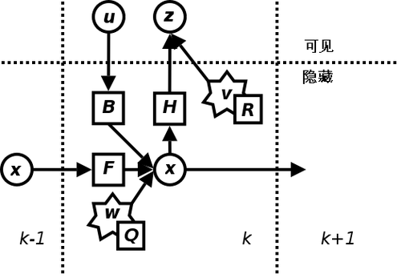

# armor_tracker

装甲板跟踪系统

## tracker_node.cpp
装甲板处理节点

ArmorTrackerNode是一个用于装甲目标跟踪的ROS节点，主要实现了两大核心功能：在RViz中可视化目标标记和在图像上绘制目标信息。该节点通过接收目标消息，结合跟踪器管理和坐标变换，实现了对装甲目标的实时可视化展示，适用于机器人视觉跟踪系统。

### 核心功能

1. 目标标记可视化（drawMarkers函数）
根据目标消息在RViz中生成可视化标记，包括位置标记、线速度箭头、角速度箭头和装甲板模型
* 当目标处于跟踪状态时，获取对应跟踪器并解析目标状态参数（位置、速度、偏航角等）
* 生成位置标记点，线速度箭头（从位置点指向速度方向），角速度箭头（垂直于位置点，反映偏航角速度）
* 根据装甲数量（armors_num）和类型（小/大装甲）绘制装甲板分布

2. 图像目标绘制（drawImgAll函数）
在相机图像上绘制目标的装甲板轮廓和ID信息，支持主要目标高亮显示
* 解析相机内参与畸变参数，用于坐标变换
* 根据目标ID生成差异化颜色，主要目标使用绿色高亮
* 计算每个装甲板的世界坐标，考虑pitch角度（前哨站为-0.26，其他为0.26）
* 通过TF变换获取相机到世界坐标系的转换矩阵，实现3D到2D投影
* 使用projectPoints函数将装甲板角点从世界坐标投影到图像平面
* 在图像右上角标注目标ID，并绘制装甲板四边形轮廓

## extended_kalman_filter.cpp

$$ x_c = x_a + r * cos (\theta) $$
$$ y_c = y_a + r * sin (\theta) $$

$$ x = [x_c, y_c,z, yaw, v_{xc}, v_{yc},v_z, v_{yaw}, r]^T $$

参考 OpenCV 中的卡尔曼滤波器使用 Eigen 进行了实现

[卡尔曼滤波器](https://zh.wikipedia.org/wiki/%E5%8D%A1%E5%B0%94%E6%9B%BC%E6%BB%A4%E6%B3%A2)

考虑到自瞄任务中对于目标只有观测没有控制，所以输入－控制模型 $B$ 和控制器向量 $u$ 可忽略。

预测及更新的公式如下：

预测：

$$ x_{k|k-1} = F * x_{k-1|k-1} $$

$$ P_{k|k-1} = F * P_{k-1|k-1}* F^T + Q $$

更新:

$$ K = P_{k|k-1} * H^T * (H * P_{k|k-1} * H^T + R)^{-1} $$

$$ x_{k|k} = x_{k|k-1} + K * (z_k - H * x_{k|k-1}) $$

$$ P_{k|k} = (I - K * H) * P_{k|k-1} $$

## tracker.cpp

Tracker类实现了基于扩展卡尔曼滤波器 (EKF) 的装甲目标跟踪系统，用于敌方装甲目标的状态估计与跟踪。该跟踪器支持单装甲和双装甲初始化，能够根据传感器数据更新目标状态，并通过状态机管理跟踪状态（检测中、跟踪中、临时丢失、完全丢失）。

参考 [SORT(Simple online and realtime tracking)](https://ieeexplore.ieee.org/abstract/document/7533003/) 中对于目标匹配的方法，使用卡尔曼滤波器对单目标在三维空间中进行跟踪

在此跟踪器中，卡尔曼滤波器观测量为目标在指定惯性系中的位置（xyz），状态量为目标位置及速度（xyz+vx vy vz）

在对目标的运动模型建模为在指定惯性系中的匀速线性运动，即状态转移为 $x_{pre} = x_{post} + v_{post} * dt$

目标关联的判断依据为三维位置的 L2 欧式距离

跟踪器共有四个状态：
- `DETECTING` ：短暂识别到目标，需要更多帧识别信息才能进入跟踪状态
- `TRACKING` ：跟踪器正常跟踪目标中
- `TEMP_LOST` ：跟踪器短暂丢失目标，通过卡尔曼滤波器预测目标
- `LOST` ：跟踪器完全丢失目标

工作流程：

- init：

  跟踪器默认选择离相机光心最近的目标作为跟踪对象，选择目标后初始化卡尔曼滤波器，初始状态设为当前目标位置，速度设为 0

- update:

  首先由卡尔曼滤波器得到目标在当前帧的预测位置，然后遍历当前帧中的目标位置与预测位置进行匹配，若当前帧不存在目标或所有目标位置与预测位置的偏差都过大则认为目标丢失，重置卡尔曼滤波器。
  
  最后选取位置相差最小的目标作为最佳匹配项，更新卡尔曼滤波器，将更新后的状态作为跟踪器的结果输出

## tracker_manager.cpp

TrackerManager类是跟踪器的管理中枢，提供了跟踪器生命周期管理、目标信息获取、跟踪器状态更新等功能，负责创建、维护和协调管理多个跟踪器。

1. 跟踪器生命周期管理
* 跟踪器创建：根据目标ID创建新的跟踪器实例
* 跟踪器存储：使用std::unordered_map存储跟踪器，键为目标ID
* 跟踪器清理：移除长时间未更新的跟踪器（超过lost_time_thres_）；移除状态为LOST的跟踪器
* 冷却机制：跟踪器切换后设置冷却时间switch_cooldown_，避免频繁切换

2. 目标信息获取与封装
* 单目标信息获取：getIDTarget方法根据ID获取目标状态，封装为auto_aim_interfaces::msg::Target消息，包含位置、速度、角度、半径等跟踪状态参数，同时根据跟踪状态标记tracking字段（DETECTING为false，TRACKING/TEMP_LOST为true）
* 活跃跟踪器列表：getActiveTrackerIDs获取所有非LOST状态的跟踪器ID

3. 跟踪器统一控制
* EKF模板更新：updateEKFTemplate统一设置所有跟踪器的EKF时间间隔
* 批量状态更新：配合外部逻辑实现跟踪器的批量更新